# Uncovering the "Human Story" of Depression in NHANES Data

In this project, we processed a multitude of columns from the NHANES dataset. By applying machine learning methods, we identified the most significant variables associated with depression risk. We then used traditional statistical visualizations to explore these key factors individually, uncovering the "human story" behind the data.

## Defining Depression

For our target variable, we utilized the **PHQ-9 (Patient Health Questionnaire)** screening data available in NHANES.

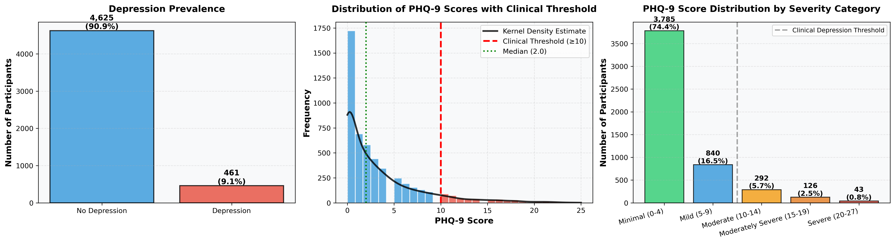

The PHQ-9 is a standard instrument for screening depression. It consists of 9 questions, each scored from 0 to 3. A total score of **10 or higher** is the standard clinical threshold for identifying likely cases of depression, which we used as our binary target for classification.

## Feature Importance: The Roadmap

To determine which of the hundreds of available metrics matter most, we trained a **Random Forest** classifier. This algorithm helps us rank features by their predictive power.

Based on this model, we identified the top 15 most important factors. Interestingly, the data points clearly towards a "Big Three" of socio-demographic drivers, followed by biological markers.

---

## The "Big Three": Socio-Demographic Drivers

The modeling results consistently highlight that socio-demographic status is the primary predictor of depression risk in this dataset.

### 1. General Health Condition
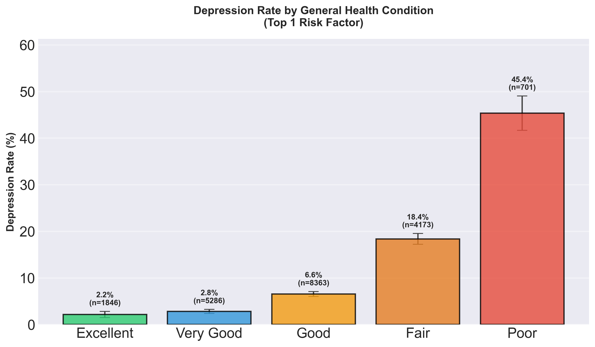
The `General_Health_Cond` variable is a self-reported rating of overall health on a scale from **1 (Excellent)** to **5 (Poor)**. As seen in the graph, there is a stark correlation: individuals rating their health poorly are significantly more likely to screen positive for depression.

### 2. Sleep Issues
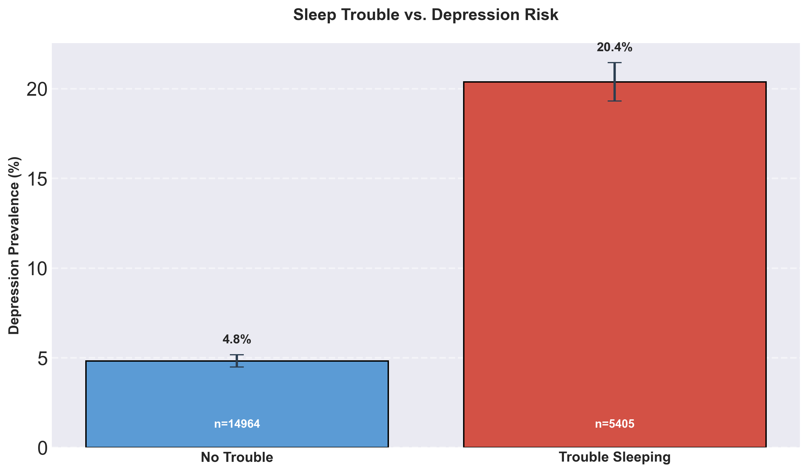
This variable captures whether a participant has ever told a doctor or other health professional that they have trouble sleeping. The data shows a strong link between those seeking medical help for sleep problems and those meeting the criteria for depression.

### 3. Economic Status (Poverty Ratio)
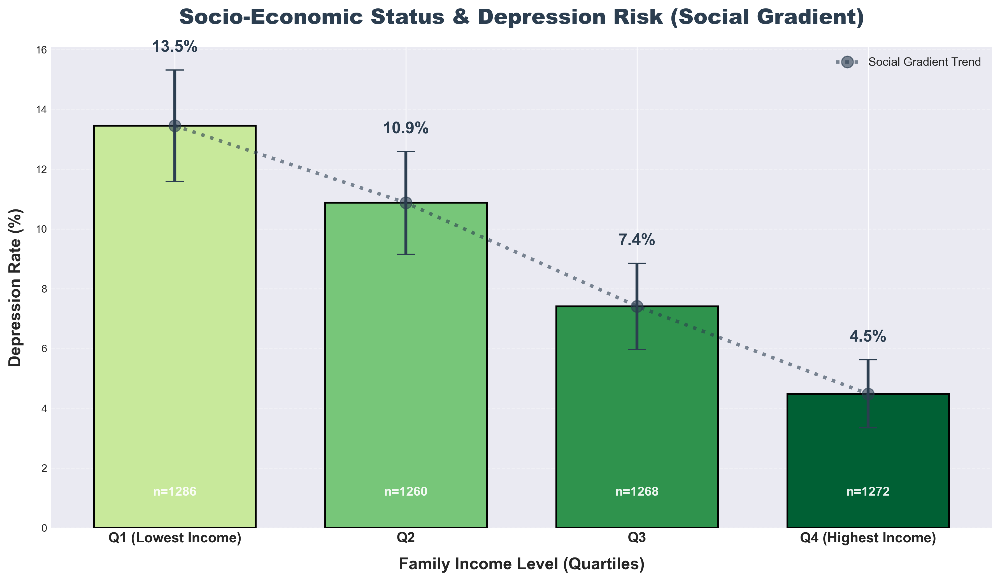
The Income-to-Poverty ratio is a standard economic metric.
*   **0 - 1**: Living in poverty.
*   **5**: Income is 5x the poverty threshold (or higher).
The gradient is clear: as financial stability increases (moving towards 5), the prevalence of depression drops significantly.

---

## Other Interesting Correlations

Beyond the top drivers, we explored other profound demographic connections.

### Marital Status and the "Trust" Factor
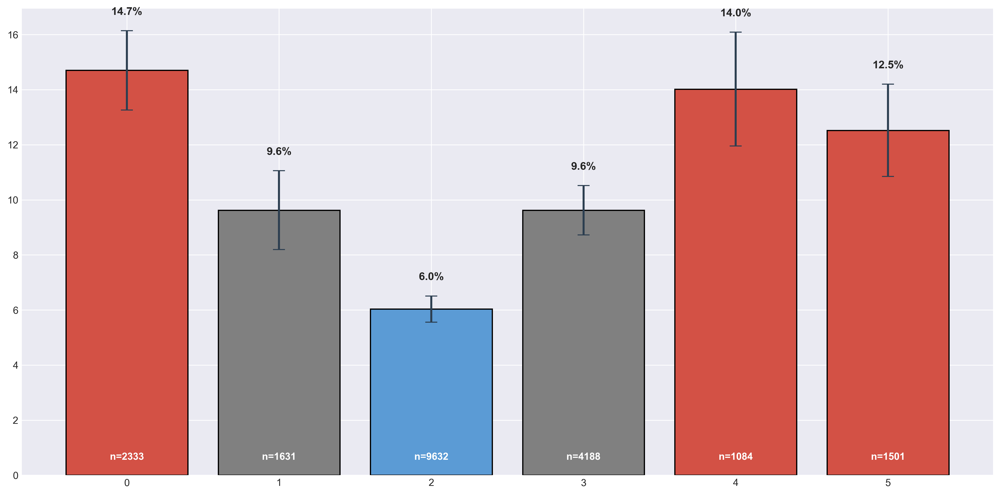
Marriage appears to be a strong protective factor against depression. Interestingly, people who are "Living with a partner" but not married show higher depression rates than those who are married. This suggests that the legal and social commitment of marriage—and potentially the deeper sense of security and trust it implies—may play a distinct psychological role compared to cohabitation alone.

### Gender Differences
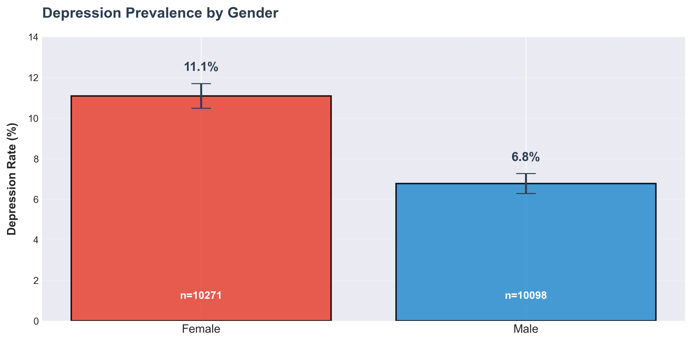
Our analysis confirms well-established epidemiological findings: women in the dataset show a higher prevalence of depression compared to men.

### Race and Ethnicity
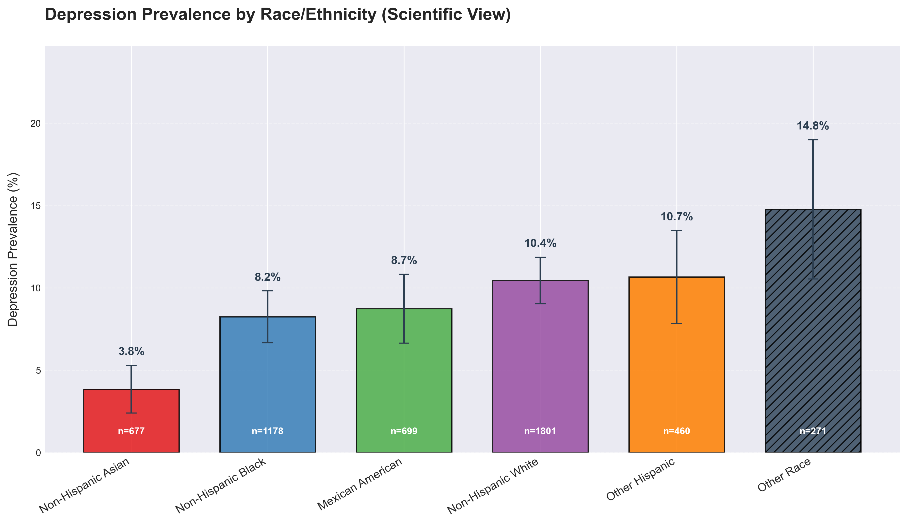
The data reveals distinct variations in depression rates across different racial and ethnic groups. Research suggests this is a complex interplay of socioeconomic disparities, access to healthcare, cultural stigmas surrounding mental health, and varying levels of social support systems.

### Education Level
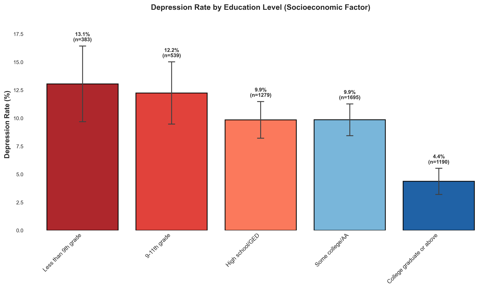
Education acts as a powerful proxy for socioeconomic status. Higher educational attainment generally correlates with lower depression risk, likely reflecting better economic stability, health literacy, and access to resources.

---

## Biological Findings

While socio-demographics dominate, we also found significant biological associations.

### Body Fat Percentage
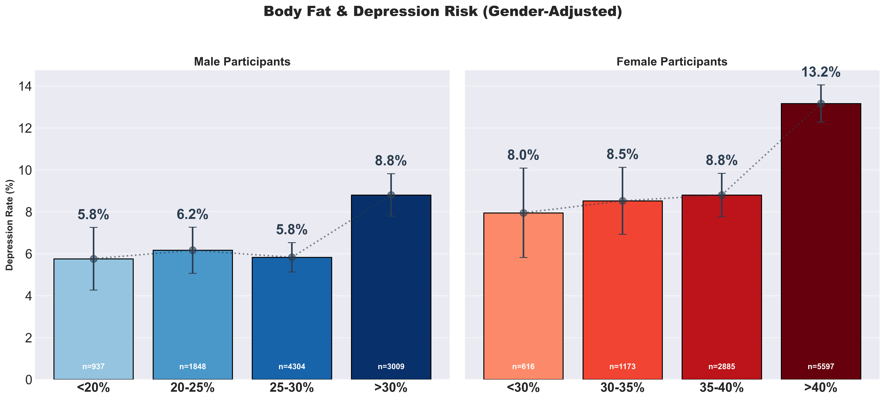
We observed a correlation between higher body fat percentages and increased depression risk, which aligns with research linking metabolic health and mental well-being.

### Cadmium Exposure
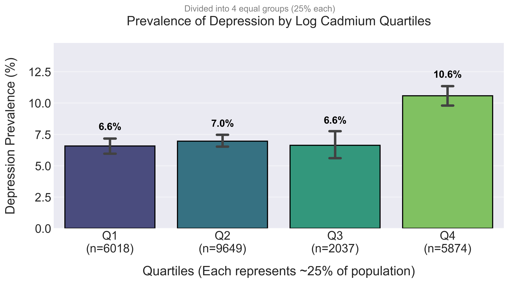
We analyzed blood Cadmium levels (using log-transformed values to normalize the distribution). Higher levels of Cadmium, a toxic heavy metal often associated with smoking and environmental pollution, correlate with a higher chance of depression.

### Inflammation (C-Reactive Protein)
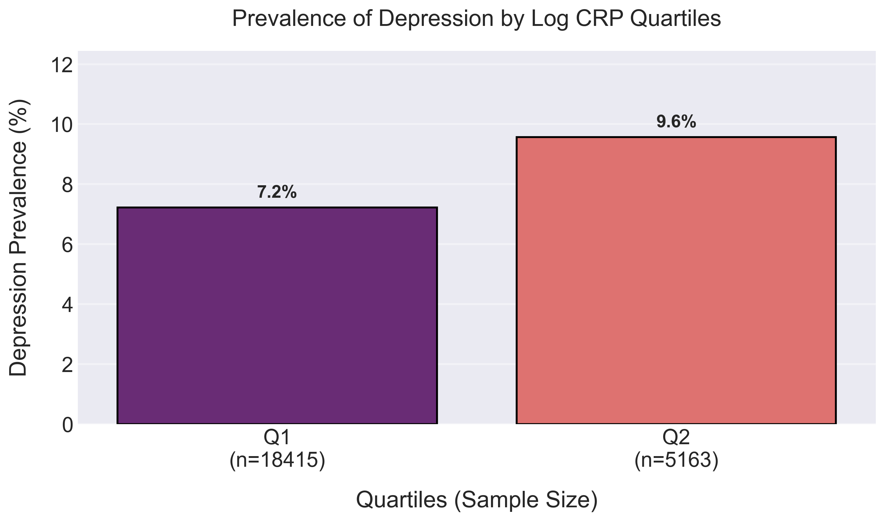
Our analysis of High-Sensitivity C-Reactive Protein (hs-CRP) supports the "Inflammatory Theory of Depression." Elevated markers of systemic inflammation are visibly associated with higher rates of depression in our sample.

### The Mercury Paradox
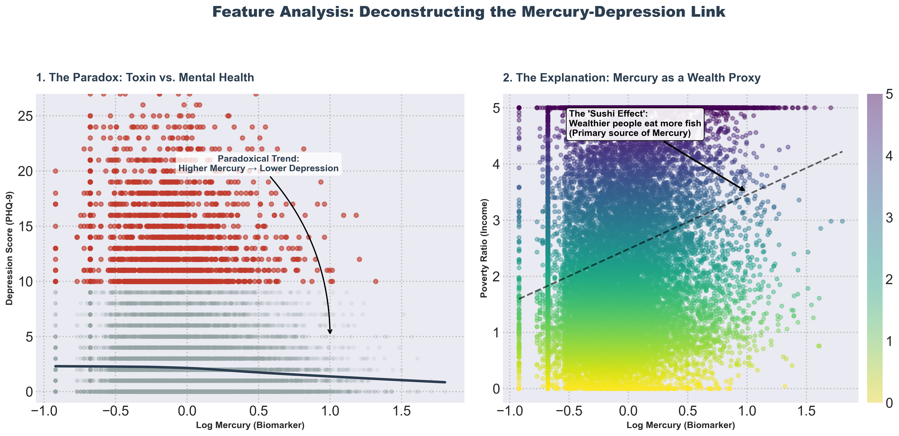
Curiously, our data shows that higher levels of blood mercury are associated with a *lower* risk of depression.
*   **Why?** This is likely a confounder related to diet. Mercury accumulation often comes from consuming fish (like tuna or salmon).
*   **The "Fish Hypothesis"**: People who eat more fish tend to have higher Omega-3 fatty acid intake and generally healthier diets, which are protective against depression. Thus, high mercury in this context likely serves as a proxy for high fish consumption, masking the direct toxicity of the metal.

---

## Conclusions & Limitations

Our analysis leads to a few key takeaways:

1.  **Socio-demographics are King**: The strongest predictors of depression in this dataset are how healthy, wealthy, and socially connected people feel.
2.  **Biological Complexity**: Biological markers like inflammation and toxins (Cadmium) play a role, but their signal is often weaker than the "Big Three."
3.  **Limitations**:
    *   **Associations, not Causation**: All findings here are correlations.
    *   **Population Weights**: For the sake of clear and interpretable visualization, we did not apply NHANES population weights. While this makes the graphs easier to read, it means these results are strictly for the *sample* and may not perfectly reflect the US population census.