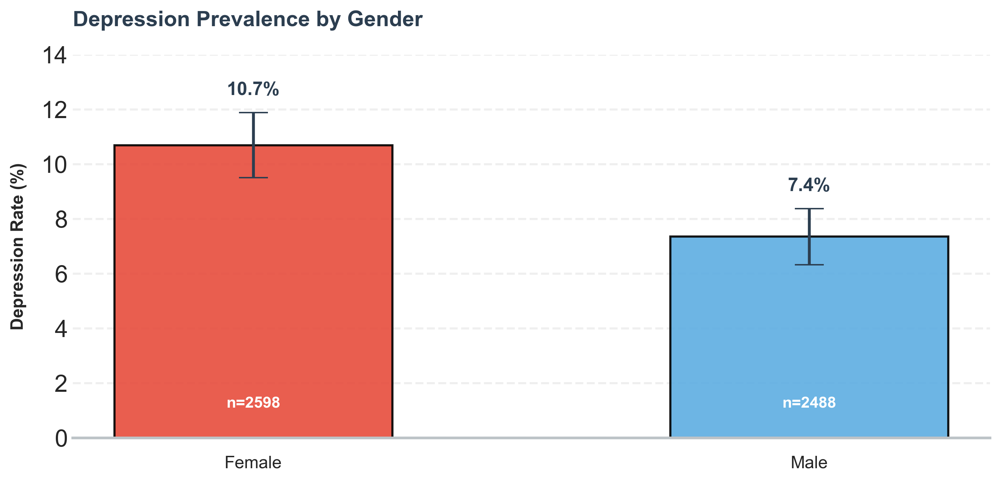
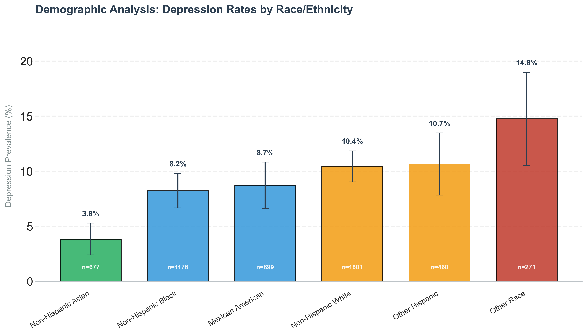
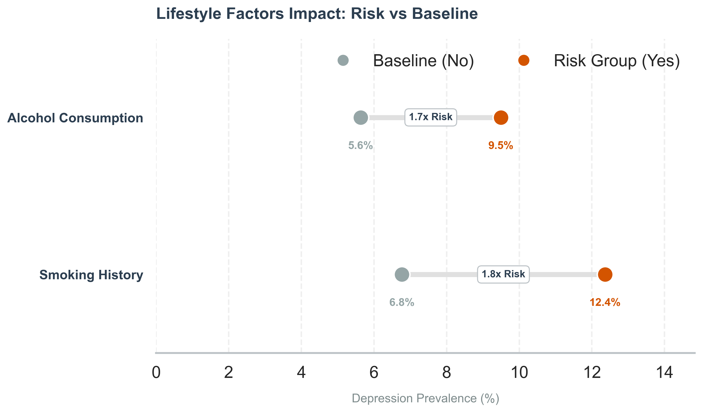
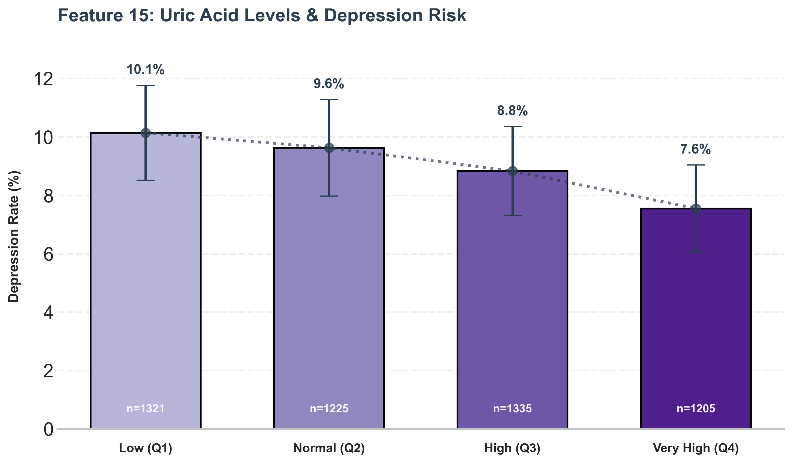
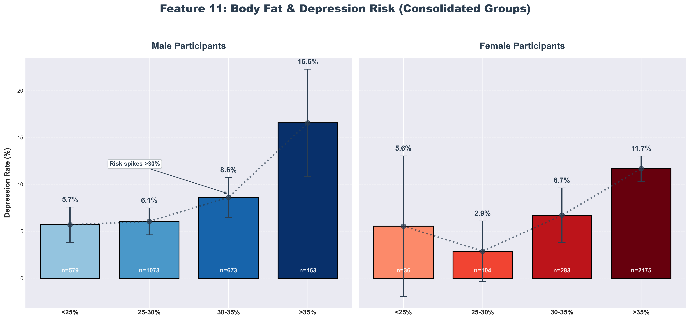

# NHANES Data Analysis Pipeline
### Statistical Analysis of Depression Risk Factors (2005-2018)

## 📋 Project Overview

This project conducts a comprehensive analysis of depression risk factors using data from the **National Health and Nutrition Examination Survey (NHANES)**. The goal was not merely to predict depression, but to identify, rank, and interpret the statistical associations between physiological biomarkers, lifestyle habits, and mental health status.

Using a **Random Forest** algorithm as a feature selection tool, we uncovered that objective biological markers often carry as much signal as traditional socio-economic indicators.

---

## 📉 Part 1: The Baseline - Depression Prevalence

Before analyzing specific risk factors, it is critical to understand the distribution of the target variable within the population. We used the **PHQ-9 (Patient Health Questionnaire)** screening tool to define mental health status.

* **Target Variable:** PHQ-9 Score (Range: 0-27)
* **Clinical Threshold:** A score of **$\ge$ 10** indicates clinically significant depression.

### The "Iceberg" of Mental Health
While the dataset is heavily imbalanced towards healthy individuals, the severity breakdown reveals the scale of the clinical group.

**Breakdown of the Clinical Population (Score $\ge$ 10):**
The analysis focuses on distinguishing the distinct "tail" of the distribution. Out of the processed population, **461 participants (9.1%)** met the criteria for clinical depression. This group is composed of:
* 🟡 **Moderate (10-14):** 292 participants
* 🟠 **Moderately Severe (15-19):** 126 participants
* 🔴 **Severe (20-27):** 43 participants (Critical urgency)

---

## 📊 Part 2: Social & Demographic Determinants

The analysis confirms that mental health is deeply rooted in the social context. We observed distinct patterns across gender and racial groups.

### 1. The Gender Gap
Females show a consistently higher prevalence of depression symptoms compared to males.

### 2. Race & Ethnicity
Our analysis revealed significant disparities across demographic groups. Notably, the **"Non-Hispanic Asian"** group demonstrates the lowest risk profile, while the **"Other/Multi-Racial"** category shows the highest prevalence. This suggests that social integration and community support systems may play a crucial role.

---

## 🧬 Part 3: Biological & Lifestyle Insights

Moving beyond demographics, the model identified powerful associations with lifestyle choices and metabolic health.

### 3. Lifestyle Factors (Smoking & Alcohol)
The model validated the "Healthy Lifestyle" hypothesis. Individuals with a history of smoking show significantly higher depression rates compared to non-smokers. Interestingly, the data also highlights the cumulative risk of unhealthy behaviors.

### 4. Metabolic Stress: Uric Acid
We analyzed Uric Acid levels (divided into quartiles). The data shows a clear trend: higher levels of metabolic waste products correlate with higher depression rates, supporting the **"Inflammatory Theory of Depression"**.

### 5. Body Composition (Biological Differences)
The relationship between Body Fat and depression is not linear and differs by gender.
* **Males:** Risk spikes significantly when body fat exceeds **30%**.
* **Females:** The risk progression is more gradual, peaking after **35%**.

### 6. The "Mercury Paradox" (Confounder Analysis)
Initial Feature Importance suggested that higher Mercury levels might be "protective." A deeper dive revealed this as a **false correlation**. Mercury acts as a proxy for **Income Level**: wealthier individuals consume more seafood (source of Mercury) and have better access to healthcare.

---

## ⚙️ Methodology & Technical Decisions

To ensure the integrity of the analysis, several key technical decisions were made:

### 1. Data Leakage Prevention
Features related to **Sleep Disorders** (e.g., "Trouble sleeping") were explicitly **removed** from the dataset. Since sleep disturbance is a direct component of the PHQ-9 diagnostic criteria (Question #3), including it would constitute Target Leakage, artificially inflating the model's accuracy without adding analytical value.

### 2. Weighting Strategy
NHANES provides complex survey weights (`MEC_Weights`) to extrapolate data to the US population.
* **Decision:** We proceeded with an **Unweighted Analysis**.
* **Reasoning:** Empirical testing showed that incorporating weights significantly increased computational complexity without yielding a statistically significant improvement in Feature Selection stability or Model RMSE. We prioritized signal clarity and interpretability.

---

## 📉 Limitations & Conclusion

* **Correlation ≠ Causation:** As NHANES is a cross-sectional study, findings represent statistical associations, not causal relationships.
* **Biomarkers:** While markers like Cadmium and Uric Acid show strong predictive power, they should be interpreted as potential indicators of systemic stress rather than direct causes of depression.

**Key Takeaway:** Depression is multifactorial. The strongest models combine subjective health assessments with objective metabolic biomarkers and socio-economic context.