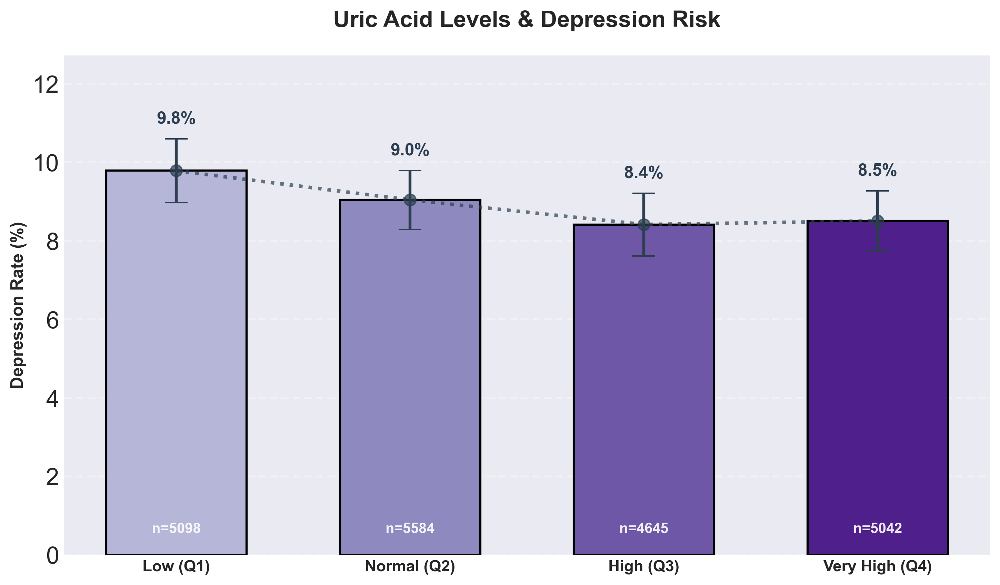
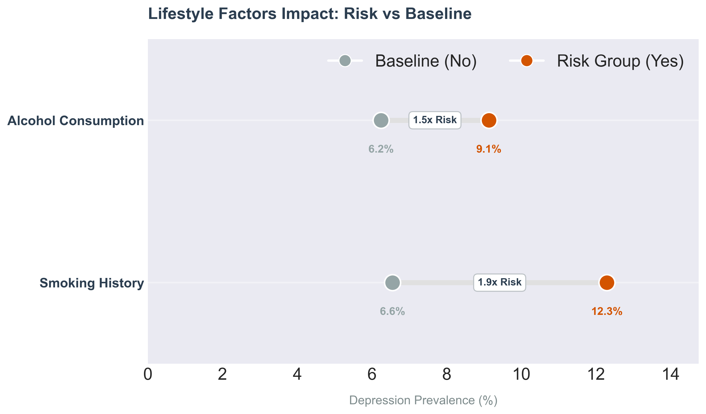

# NHANES Data Analysis Pipeline: Determinants of Depression Risk
### Multi-modal Statistical Analysis & Machine Learning (2005-2018)

## 📋 Project Overview

This project conducts a comprehensive analysis of depression risk factors using data from the **National Health and Nutrition Examination Survey (NHANES)**. The objective was to identify and interpret statistical associations between physiological biomarkers, socioeconomic status, and mental health.

**Important Note:** Findings in this study represent **statistical correlations and associations**, not direct causal relationships.

---

## 📉 Part 1: Clinical Baseline

We defined mental health status using the **PHQ-9 (Patient Health Questionnaire)**.
* **Target:** PHQ-9 Score $\ge$ 10 (Clinically significant depression).
* **Prevalence:** 9.1% of the study population met the clinical criteria.

---

## 📊 Part 2: Socioeconomic & Demographic Determinants

Mental health shows a deep statistical link with social context. Our analysis revealed two dominant trends in risk distribution:

### 1. Financial Stability (The Social Gradient)
A clear linear association exists between household income and depression prevalence.
* **Lowest Income (Q1):** 13.5% prevalence.
* **Highest Income (Q4):** 4.5% prevalence.

### 2. Education Level
Higher educational attainment shows a strong protective association, often functioning in synergy with higher income levels.
* **College Graduates:** Demonstrate the lowest prevalence (**4.4%**).
* **Observation:** Education serves as a proxy for both cognitive resilience and economic security.

### 3. Marital Status: Two Distinct Risk Trends
Updated analysis of marital status reveals a clear stratification of the population into two risk groups:

* **The High-Risk Group (Post-Relationship Stress):** Individuals who are **Divorced (14.3%)**, **Widowed (13.9%)**, or **Separated (13.8%)** show the highest prevalence. This suggests a strong correlation between relationship dissolution/loss and mental health vulnerability.
* **The Lower-Risk Group (Stable or Single):** Individuals who are **Married (6.1%)**, **Living with Partner (9.3%)**, or **Never Married (9.9%)** exhibit significantly lower rates.

**Key Insight:** Official **Marriage (6.1%)** is uniquely associated with the lowest risk in the entire dataset. Even when compared to "Living with Partner," marriage shows a distinct statistical advantage, suggesting that the formal marital bond correlates with unique protective social or psychological factors.

### 4. Race & Ethnicity
Granular analysis shows **Non-Hispanic Asian** populations have the lowest associated risk (**3.8%**), while the **Other/Multi-Racial** group shows the highest prevalence (**14.8%**).

### 5. The Gender Gap
Consistent with epidemiological trends, females in the NHANES dataset show a higher prevalence of depression symptoms compared to males.

---

## 🧬 Part 3: Biological Insights & Lifestyle

### 6. Metabolic Defense: Uric Acid
A key finding is the inverse correlation between **Uric Acid** and depression.
* **Hypothesis:** Uric Acid is a major **endogenous antioxidant**. Higher levels are statistically associated with **lower depression rates**, likely due to its role in neutralizing oxidative stress and acting as a neuroprotective agent.

### 7. Lifestyle Factors (Smoking & Alcohol)
Lifestyle choices show a significant statistical relationship with mental health. Individuals with a history of smoking exhibit higher depression rates, validating the cumulative risk of systemic stressors.

### 8. The "Mercury Paradox" (Confounder Analysis)
Initially, Mercury appeared "protective." However, deep-dive analysis confirmed it as a **Socioeconomic Confounder**. Higher Mercury levels are a proxy for frequent seafood consumption, which correlates with high-income quartiles (Q4) rather than being a biological driver.

---

## ⚙️ Methodology & Technical Rigor

### 1. Target Leakage Prevention
To ensure the integrity of the feature importance ranking, all sleep-related variables were removed. Since sleep disturbance is a diagnostic component of the PHQ-9, its inclusion would artificially inflate model metrics without providing actionable insights.

### 2. Analytical Approach
We utilized an **unweighted analysis** to prioritize the identification of stable statistical signals. All findings highlight **correlations**, providing a foundation for further causal longitudinal studies.

---

## 📉 Conclusion

The strongest associations with mental health stability are found at the intersection of:
1. **Physiological Factors:** Antioxidant capacity (Uric Acid).
2. **Social Stability:** The unique protective correlation of **Marriage**.
3. **Socioeconomic Status:** The symbiotic relationship between **Income and Education**.

**Key Takeaway:** By accounting for confounders like Mercury and identifying protective markers like Uric Acid, this pipeline provides a sophisticated, multi-modal view of depression risk factors.